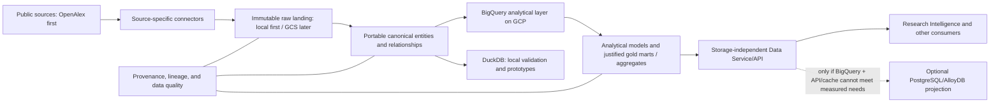

# Research Intelligence Data Platform

A local-first platform for public scholarly and research data, with **OpenAlex
first**, portable canonical schemas, and **BigQuery as the first analytical
implementation on GCP**. DuckDB supports local validation and prototyping.
PostgreSQL/AlloyDB is an optional operational projection, justified by benchmarks
rather than required by the target architecture.

Development uses public OpenAlex or synthetic data only. No Wiley enterprise
access, proprietary data, or cloud credentials are needed for the default tests.

## Current status

**Steps 01-09 are complete, and Step 10 adds pipeline-control/provenance
contracts. The full data pipeline is not implemented.**

| Step | Delivered capability | Implementation boundary |
| --- | --- | --- |
| 01 | Repository foundation | Python packaging, typed interfaces, structured logging, tests, CI, and optional local PostgreSQL tooling |
| 02 | Configuration framework | Validated YAML, environment substitution, explicit environment selection, and strict sample limits |
| 03 | Storage contracts | `ObjectStore` and immutable-write semantics; GCS remains a skeleton |
| 04 | Warehouse contracts | Parameterized query/PyArrow interface; DuckDB, BigQuery, and PostgreSQL adapters remain skeletons |
| 05 | Bounded OpenAlex connector | Anonymous manifest discovery and separate caller-owned streaming retrieval |
| 06 | Works manifest parser | Pure parsing, validated metadata, stable identities, and duplicate/conflict handling |
| 07 | Development sample selector | Deterministic, metadata-only selection with file-count and byte-size bounds |
| 08 | Bounded source profiling | One-file JSONL/JSONL.GZ streaming sample and footer-first Parquet profile with evidence-classified reports; live payload profile pending public network access |
| 09 | Immutable local raw landing | `LocalObjectStore` with atomic content/provenance publish, OpenAlex raw key layout, replay/conflict, and offline contract tests |
| 10 | Pipeline control contracts | `PipelineRun`, `SourceFileControl`, `RecordProvenance`, lifecycle/claim rules, `ControlStore` protocol, and versioned PostgreSQL DDL specs |

Constructing adapters or loading configuration does not connect to services.
`LocalObjectStore` writes only under the configured local landing path. Control
models and `ControlStore` are contracts only: no database persistence, claims, or
ingestion loop. The GCS adapter remains a skeleton.

**Still planned:** GCS landing, canonical modeling, ingestion, change/deletion
processing, analytical models, gold marts, data quality, consumer APIs, and
orchestration. There is no implemented GCS/BigQuery deployment or production
pipeline.

### Next scoped work

**Step 10: pipeline control and provenance** is delivered for
[issue #18](https://github.com/agilandeenadhayalan41/research-intelligence-data-platform/issues/18).
See [pipeline control](docs/architecture/pipeline-control.md) for lifecycle,
claim/lease, idempotency, and the write-boundary protocol. Immutable retrieval
provenance remains `IngestionProvenance` beside raw objects.

**Step 11: canonical OpenAlex model**
([issue #15](https://github.com/agilandeenadhayalan41/research-intelligence-data-platform/issues/15))
is next and requires a separate assignment. Keep
[issue #2](https://github.com/agilandeenadhayalan41/research-intelligence-data-platform/issues/2)
as the open umbrella roadmap. Assign one scoped issue at a time and stop after
its reviewable PR; do not reopen completed work or automatically start later steps.

## Target architecture

The following diagram is the **target**, not a claim that these components are
already running:



- **Preserve the source.** Immutable raw bytes and provenance must support replay
  without overwrites. Atomic publication and conflict handling belong in storage
  adapters.
- **Keep canonical data portable.** Model entities and relationships separately;
  do not create a giant flattened table or couple canonical schemas to a serving
  engine. Use Parquet only where applicable.
- **Start GCP analytics with BigQuery.** Derive partitioning, clustering, bounded
  scans, and materializations from query evidence. DuckDB results do not prove
  BigQuery SQL compatibility.
- **Measure before adding operational storage.** Benchmark latency, concurrency,
  freshness, frequency, scanned bytes, cost, and result size against BigQuery with
  an API/cache. Do not copy the full analytical relationship model into PostgreSQL.
- **Publish capabilities, not unrestricted SQL.** Future consumers should use
  storage-independent metadata lookup, journal metrics, and publisher analytics.
  Aggregate multi-valued relationships independently to avoid double counting.

See the [platform architecture](docs/architecture/platform-architecture.md),
[BigQuery-first guidance](docs/architecture/gcp-bigquery-first.md), and
[query-routing strategy](docs/architecture/query-routing.md) for the design
decisions and boundaries.

## Implemented OpenAlex flow

```text
Public Works manifest
  -> bounded manifest retrieval
  -> pure manifest parser
  -> deterministic bounded sample selector
  -> selected SourceAsset metadata
  -> explicit fetch() call
  -> caller-owned bounded source-byte stream
```

Discovery does not fetch source data files. Retrieval does not write raw data,
canonicalize records, load a warehouse, or run a pipeline.

| API | Responsibility |
| --- | --- |
| `OpenAlexAssetMetadata` | Validates source format, URI, dates, sizes/counts, and stable asset identity |
| `parse_openalex_works_manifest()` | Parses caller-provided JSON text, UTF-8 bytes, or a mapping without I/O |
| `select_openalex_works_sample()` | Returns selected metadata, configured bounds, eligibility counts, and safe skip reasons |
| `OpenAlexConnector.discover()` | Retrieves only the selected-format Works manifest and reuses the parser/selector |
| `OpenAlexConnector.discover_metadata()` | Returns the bounded selection with validated metadata; `discover()` delegates to it |
| `OpenAlexConnector.fetch()` | Returns a caller-owned binary stream with actual-byte enforcement and explicit failures |
| `profiling.profile_openalex_asset()` | Checks metadata, retrieves one bounded file, and returns an evidence-classified JSONL or Parquet profile |
| `openalex_raw_object_key()` | Builds a deterministic local raw content key from validated OpenAlex metadata |
| `LocalObjectStore.put_if_absent()` | Streams bytes, verifies SHA-256, and atomically publishes content + provenance |
| `LocalObjectStore.open()` | Returns a caller-owned read-only stream for a committed object |

The selector defaults are exactly `max_files=1` and
`max_file_size_bytes=25_000_000` (decimal bytes). Invalid limits are rejected, never
interpreted as unlimited. Unknown-size and oversized assets are excluded; eligible
assets are ranked smallest first with deterministic tie-breaking.

Manifest reads have a separate 1,000,000-byte cap. Payload retrieval uses bounded
reads, checks actual cumulative bytes independently of metadata, and uses a
one-byte probe to detect overflow. Responses are closed on EOF, caller close, or
failure. Request retries/timeouts are bounded, and returned streams are never
restarted after partial delivery.

The connector supports the current Works `jsonl` and `parquet` namespaces in the
public `openalex` bucket, mapped to the fixed `openalex.s3.amazonaws.com` HTTPS
host. It uses no AWS credentials, authenticated fallback, or redirects. The
default manifest endpoint is:

```text
https://openalex.s3.amazonaws.com/data/jsonl/works/manifest.json
```

OpenAlex documents gzip-compressed JSONL and Snappy-compressed Parquet.
Anonymous HEAD and bounded manifest-prefix observations verified metadata access
and the declared formats, not the payload codecs. The cloud-agent connectivity
attempt was separately blocked by its runtime firewall. See the
[OpenAlex contract](docs/architecture/openalex-manifest-contract.md) for dated
evidence, exact format/identity rules, error categories, and stream ownership.

The explicit network check reads only the bounded JSONL Works manifest:

```powershell
python -m research_platform.sources.openalex.connectivity
```

This command is **opt-in**, may fail under network restrictions, and is not part
of default tests or CI. It does not fetch a snapshot data file or contact GCP.

The separate, explicit Step 08 profile command reads both Works manifests, then
retrieves and profiles at most one bounded file (default 25,000,000 bytes, 100
sampled records):

```powershell
python -m research_platform.sources.openalex.profiling --format jsonl
```

It is also opt-in and excluded from tests/CI. See
[OpenAlex source profiling](docs/architecture/openalex-source-profiling.md) for the
evidence classes, bounds, verified representations, and format recommendation.

## Local development

Requires **Python 3.12+ and Make**. Docker Compose is optional and is not needed
for the default test suite. Dependencies and package metadata are defined in
[`pyproject.toml`](pyproject.toml): Pydantic, PyYAML, and PyArrow at runtime, with
pytest and DuckDB for development. Direct dependencies are pinned; a complete
transitive lockfile is not provided.

From the repository root, create a virtual environment. In PowerShell:

```powershell
python -m venv .venv
.\.venv\Scripts\Activate.ps1
```

On Linux/macOS, activate the environment with `source .venv/bin/activate` instead.
Then use the existing Make targets:

```text
make install
make test
make check
make build
```

| Command | Purpose |
| --- | --- |
| `make install` | Install the package in editable mode with development dependencies |
| `make test` | Run all default unit and local integration tests |
| `make test-unit` | Run only unit tests |
| `make check` | Compile Python sources/tests and check installed dependency consistency |
| `make build` | Build a wheel into the ignored `dist` directory without building dependency wheels |
| `make postgres-up` / `make postgres-down` | Explicitly start/stop the optional local Compose service |

These commands come from the [Makefile](Makefile). `make check` is not a dedicated
linter, formatter, or static type checker; those targets do not currently exist.
For one focused test file in PowerShell:

```powershell
python -m pytest tests\unit\test_openalex_sample.py
```

Default tests use tiny synthetic data, fake HTTP clients/sockets, and local
DuckDB/PyArrow checks. They do not require cloud credentials, external services,
or public-source downloads.

The [Tests workflow](.github/workflows/tests.yml) runs install, check, test, and
wheel packaging on pushes and pull requests, using Python 3.12 on `ubuntu-latest`
with read-only repository permissions. Required-check enforcement is a separate
GitHub repository setting, not established by the workflow file.

## Configuration and environments

Load one configuration explicitly; do not print configuration or environment
contents:

```python
from pathlib import Path

from research_platform.common.logging import configure_logging
from research_platform.config import load_config
from research_platform.sources.openalex import OpenAlexConnector

config = load_config(Path("config") / "local.yaml")
configure_logging(config.log_level)
connector = OpenAlexConnector(sample_selection=config.sample_selection)
```

This example does not discover or retrieve anything. The
[loader](src/research_platform/config/loader.py) resolves `${VARIABLE}` references
after safe YAML parsing; missing/empty referenced values fail explicitly.
[Pydantic models](src/research_platform/config/models.py) reject unknown settings
and invalid sample limits. Relative data paths are relative to the process
working directory. Python does not automatically load `.env`.

| Configuration | Current meaning |
| --- | --- |
| [`config/local.yaml`](config/local.yaml) | Local storage settings, in-memory DuckDB settings, and bounded sample defaults |
| [`config/gcp-sandbox.yaml`](config/gcp-sandbox.yaml) | Future GCS/BigQuery identifiers from environment variables; no resources created |
| [`config/dev.yaml`](config/dev.yaml), [`config/qa.yaml`](config/qa.yaml), [`config/prod.yaml`](config/prod.yaml) | Local-only placeholders, not verified deployments |

The scaffold still includes `warehouse.transactional: postgres`; that setting
does not implement PostgreSQL persistence or make operational serving mandatory.
GCS and warehouse adapters remain skeletons; `ControlStore` is a fail-fast
protocol only. Configuration alignment and runtime persistence require separately
scoped work.

The sandbox template references `GOOGLE_CLOUD_PROJECT`, `GCS_BUCKET`, and
`BIGQUERY_DATASET`. Future cloud adapters must obtain credentials through approved
environment/ADC or workload-identity mechanisms, never tracked credential files.
Sandbox -> DEV -> QA -> PROD is a future readiness path, not deployed infrastructure.

### Optional local PostgreSQL

The [Compose file](docker-compose.yml) provides PostgreSQL 16 for explicitly
requested local tooling only:

```powershell
if (-not (Test-Path .env)) { Copy-Item .env.example .env }
# Set a unique local POSTGRES_PASSWORD in .env before starting Compose.
make postgres-up
make postgres-down
```

Do not replace an existing `.env`. Compose binds only to `127.0.0.1`, requires a
non-empty password, and preserves its named volume on `postgres-down`. It does not
run migrations or ingest data. Never put a credential-bearing `POSTGRES_DSN` in
tracked YAML or logs.

## Documentation and repository map

| Document | Read it for |
| --- | --- |
| [Platform architecture](docs/architecture/platform-architecture.md) | Layers, responsibilities, and system boundaries |
| [GCP / BigQuery-first architecture](docs/architecture/gcp-bigquery-first.md) | Analytical strategy, cost safety, and optional operational storage |
| [Query routing](docs/architecture/query-routing.md) | Benchmark categories, consumer capabilities, and materialization decisions |
| [Public data sources](docs/architecture/public-data-sources.md) | Source priorities and source-specific normalization |
| [OpenAlex contract](docs/architecture/openalex-manifest-contract.md) | Implemented metadata, parser, selector, connector, and public-access evidence |
| [OpenAlex source profiling](docs/architecture/openalex-source-profiling.md) | Bounded profiler, evidence classes, verified representations, and format decision |
| [Immutable local landing](docs/architecture/immutable-local-landing.md) | Raw key layout, atomic publish, replay/conflict, open integrity |
| [Pipeline control](docs/architecture/pipeline-control.md) | Control models, lifecycle, claims, idempotency, ControlStore boundary |
| [21-step roadmap](docs/architecture/roadmap.md) | Completed stages and separately scoped future work |
| [Copilot instructions](.github/copilot-instructions.md) | Engineering rules, phase boundaries, and required validation |

```text
config\                       Local and future environment templates
src\research_platform\
  common\                     Structured JSON logging
  config\                     Validated models and explicit YAML loading
  sources\openalex\            Metadata, parser, selector, connector, profiler, connectivity/profile CLIs
  storage\                    ObjectStore contract; LocalObjectStore; GCS skeleton
  control\                    Pipeline-control models, lifecycle, ControlStore protocol
  warehouse\                  Warehouse contract; DuckDB/BigQuery/PostgreSQL skeletons
  provenance\                 Immutable retrieval-provenance model
  ingestion\ quality\ serving\ Reserved runtime areas
tests\                        Offline unit/integration tests and synthetic fixtures
docs\architecture\            Architecture, contracts, source strategy, roadmap
sql\control\                  Versioned PostgreSQL control DDL specs (not auto-applied)
scripts\ dags\                Reserved operational tools and later orchestration
infrastructure\terraform\     Reserved infrastructure; no provisioned resources
data\                         Ignored runtime-data locations; no committed datasets
```

Reserved directories are not delivered workloads. Docusaurus publication,
Airflow/Composer, Dataform coordination, Terraform resources, and deployed APIs
remain future work.

## Public-data and delivery boundaries

OpenAlex is the only implemented source connector. AACT/ClinicalTrials is the
next planned source; OpenFDA, grants, patents, news/releases, and other public
datasets remain future extensions. Each needs its own verified source contract
and normalization; the OpenAlex schema must not be imposed on other sources.

- Work in small, explicitly selected phases. For code changes, run `make test`,
  `make check`, and `make build`; resolve failures before presenting the PR.
- Never commit credentials, `.env`, service-account JSON, or downloaded datasets.
  Keep credential files outside the repository. Do not hardcode cloud project IDs
  or log credentials, DSNs, environment contents, or sensitive payloads.
- Preserve raw bytes and immutable provenance. Future ingestion must attach run
  identity, source URI, retrieval time, and a checksum calculated from actual bytes;
  a metadata-derived asset ID is not a payload checksum.
- Do not access production, create cloud resources, or start other roadmap tasks
  without explicit authorization. A configuration template is not proof of access,
  readiness, or deployment.
- Do not implement Wiley content ingestion, internal services, LLM/ML/GenAI/NLP,
  embeddings, or knowledge graphs as part of the current platform stages. Future
  consumers remain separate from this repository's delivered capabilities.
