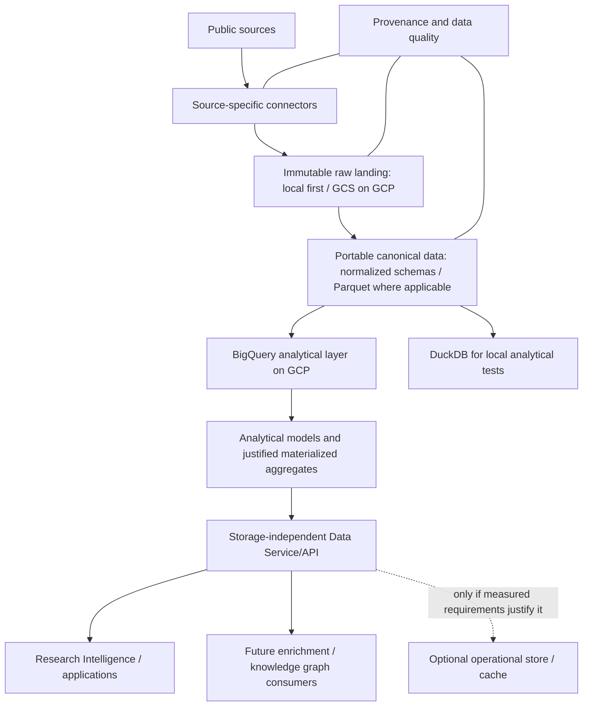

# Research Intelligence Data Platform

Local-first, cloud-ready foundation for public scholarly and research data.
Development uses **public OpenAlex or synthetic data only**, never Wiley enterprise
access or proprietary data.

## Phase 1 scope

This repository currently provides Python packaging, validated YAML configuration,
typed adapter contracts and fail-fast skeletons, structured JSON logging,
provenance metadata, a pure OpenAlex Works manifest parser and deterministic
size-bounded metadata sample selector, bounded anonymous OpenAlex snapshot manifest
discovery and file streaming, local PostgreSQL Compose tooling, offline tests, and
CI. The OpenAlex connector is the only implemented runtime network adapter; storage
and warehouse adapters remain fail-fast skeletons. Constructing an adapter or
loading configuration has no service side effects.

## Architecture



This is the **target architecture**, not a delivered pipeline. BigQuery is the
first analytical implementation on GCP; DuckDB is for local analytical tests and
prototypes. Query-pattern measurements come before any operational database
decision. PostgreSQL/AlloyDB is optional: first assess BigQuery with an API/cache,
then add an operational store only if measured latency, concurrency, or indexed
lookup requirements justify it. See [platform architecture](docs/architecture/platform-architecture.md),
[query routing](docs/architecture/query-routing.md), and
[GCP / BigQuery-first guidance](docs/architecture/gcp-bigquery-first.md).

Canonical schemas remain portable and independent of serving technology. Model
entities and relationships separately rather than creating a flattened table;
high-volume work-author, work-topic, work-institution, and citation/reference
relationships belong primarily in the analytical layer. Raw landing preserves
source bytes and provenance (run identity, source URI, retrieval time, checksum)
with immutable keys and replay/conflict handling. The ObjectStore contract defines
these semantics; runtime storage adapters are not implemented.

This is a reusable public research data platform, with OpenAlex first and AACT /
ClinicalTrials as the next planned source (tracked in
[issue #2](https://github.com/agilandeenadhayalan41/research-intelligence-data-platform/issues/2)).
OpenFDA, grants, patents, news/releases, and other public research datasets are
future source extensions, not current implementations. Existing Wiley content
ingestion, content registry/delivery, search, enrichment, and knowledge-graph
systems remain separate; this repository does not replace or implement them.

Read the [public data source strategy](docs/architecture/public-data-sources.md)
and the [21-step roadmap](docs/architecture/roadmap.md) for scope and sequencing.

### Interfaces

| Contract | Phase 1 boundary |
| --- | --- |
| `SourceConnector` | `discover()` returns manifest assets; `fetch()` returns a caller-owned stream |
| `OpenAlexAssetMetadata` | Validates one current-layout OpenAlex snapshot file description |
| `parse_openalex_works_manifest()` | Purely parses caller-provided current Works manifest content; no discovery or downloads |
| `select_openalex_works_sample()` | Selects bounded eligible metadata only; no object reads/writes or downloads |
| `OpenAlexConnector` | Anonymous manifest-only discovery plus size-limited streaming retrieval |
| `ObjectStore` | `put_if_absent()` requires provenance and never overwrites; `open()` is read-only |
| `Warehouse` | `query()` accepts bound parameters and returns a PyArrow table |

Skeletons: local/GCS object stores; PostgreSQL, BigQuery, and DuckDB warehouses.
Cloud SDKs and database drivers are deliberately deferred. PostgreSQL is optional,
not the default serving requirement. Warehouse SQL and parameter conventions
remain backend-specific; the interface does not promise portable SQL. Writes and
migrations need later explicit contracts. The Data Service/API consumer contract
is storage-independent and is a future capability, not an implemented service.
The OpenAlex Works manifest parser, snapshot metadata model, identity and duplicate
rules, and bounded sample-selection contract are specified in
[the OpenAlex discovery and manifest contract](docs/architecture/openalex-manifest-contract.md).

The connector defaults to the current Works JSON Lines manifest at
`https://openalex.s3.amazonaws.com/data/jsonl/works/manifest.json`. Public OpenAlex
The architecture contract records observed anonymous manifest access and the live
declared formats. Public documentation describes JSONL `.gz` and Snappy `.parquet`
payload codecs; these are expected codecs, not payloads inspected by this connector.
The adapter uses anonymous HTTPS only, never AWS credential discovery, and accepts
the observed `binary/octet-stream` manifest MIME while validating the bounded JSON
body.

Discovery caps the manifest at 1,000,000 actual bytes and applies the existing
selector (default one file, 25,000,000 bytes). `fetch()` returns a caller-owned
binary stream, reads in bounded chunks, enforces actual cumulative bytes including a
bounded overflow probe, checks declared length for truncation, and closes responses
on EOF, explicit close, or errors. HTTP attempts have monotonic deadlines (10
seconds by default, at most 30); at most 3 attempts are made by default, with
bounded exponential backoff. A stream is never restarted after it is returned.
`OpenAlexConnector` has no constructor-time network side effects.

The opt-in connectivity check reads only the bounded Works manifest:

The network check is opt-in and reads only the bounded Works manifest:

```bash
python -m research_platform.sources.openalex.connectivity
```

It is not invoked by tests or `make test`.

## Local development

Requires Python 3.12+ and Make. Docker Compose is optional; tests do not need it.
Run these commands from the repository root:

```bash
python -m venv .venv
source .venv/bin/activate
make install
make test-unit
make test
make check
make build
```

`make check` compiles Python and checks installed dependency consistency; a
dedicated lint/type-check tool is not introduced in this initial foundation.
`make build` creates an ignored wheel under `dist/`. Direct dependencies are pinned
in `pyproject.toml`; this is not yet a fully locked transitive environment.

Load configuration explicitly; there is no implicit production selection:

```python
from research_platform.config import load_config
from research_platform.common.logging import configure_logging

config = load_config("config/local.yaml")
configure_logging(config.log_level)
```

YAML is safely parsed, `${VARIABLE}` references are resolved from the process
environment, and Pydantic rejects unknown fields and invalid backend selections.
Missing or empty references fail early. Environment substitutions happen **after**
YAML parsing, so values cannot introduce YAML structure. Relative data paths are
relative to the current working directory. Python does not automatically load
`.env`; logs must use safe event messages, never credentials or configuration dumps.

| File | Intent |
| --- | --- |
| `config/local.yaml` | Local landing, PostgreSQL warehouse selection (skeleton), in-memory DuckDB |
| `config/gcp-sandbox.yaml` | GCS/BigQuery identifiers supplied via environment variables; no resources created |
| `config/dev.yaml`, `config/qa.yaml`, `config/prod.yaml` | Local-only placeholders, not deployment configurations |

The sandbox template requires `GOOGLE_CLOUD_PROJECT`, `GCS_BUCKET`, and
`BIGQUERY_DATASET`. Credentials are not YAML settings: future adapters will use
environment-provided credentials/ADC or workload identity. No cloud credentials
are needed for Phase 1 tests. Do not connect to any production environment.

### Optional local PostgreSQL

```bash
cp .env.example .env
# Edit .env and set a unique, local-only POSTGRES_PASSWORD.
make postgres-up
make postgres-down
```

Compose binds PostgreSQL only to `127.0.0.1` and requires a non-empty password.
It does not run migrations or ingest data. `postgres-down` preserves the local
database volume; explicitly remove volumes only when intentionally discarding data.
Set `POSTGRES_DSN` in the process environment when connection behavior is added;
never place a credential-bearing DSN in tracked YAML.

## Repository layout

```text
.github/                 Copilot engineering principles and test workflow
config/                  Local and future environment YAML templates
src/research_platform/
  common/                Structured logging
  config/                Configuration models and loader
  sources/openalex/      Public OpenAlex manifest parser and bounded connector
  ingestion/             Reserved: future orchestration
  storage/               Immutable ObjectStore contract; local/GCS skeletons
  warehouse/             Warehouse contract; PostgreSQL/BigQuery/DuckDB skeletons
  provenance/            Required ingestion metadata
  quality/               Reserved: future quality checks
  serving/               Reserved: future query services
sql/
  control/ raw/ canonical/ postgres/ olap/ quality/
dags/                    Reserved: Airflow later (no DAGs yet)
scripts/                 Reserved: operational tools
tests/
  unit/ integration/ fixtures/
data/
  manifests/ sample/ landing/  Ignored runtime data; no downloaded datasets
docs/
  architecture/ development/ data-model/ runbooks/
infrastructure/
  terraform/             Reserved: infrastructure later (no resources yet)
```

Empty directories are tracked with `.gitkeep`. Architecture documentation is
maintained in `docs/architecture/`; Docusaurus publication remains deferred and
no Node application or docs deployment is introduced.

## Tests and CI

`pytest` covers configuration/environment validation, adapter contracts, bounded
OpenAlex connector behavior with synthetic responses, provenance, JSON logging, and
an offline DuckDB/PyArrow interoperability smoke test. GitHub Actions runs install,
checks, tests, and wheel packaging on Python 3.12 with read-only repository
permissions. It needs no cloud secrets, database service, or public data downloads;
the opt-in connectivity check is not part of CI.

## Security and deferred work

- Never commit credentials, `.env`, service-account JSON, or large downloaded data.
  Credential files must live outside this repository, regardless of filename.
- Never hardcode cloud project IDs, use Wiley proprietary data, or provision
  costly cloud resources. Use only public OpenAlex or synthetic test fixtures.
- Runtime GCS/BigQuery/PostgreSQL adapters, actual ingestion, canonical SQL
  migrations, deployed serving, Airflow, Terraform resources, and Docusaurus site
  setup are deferred. BigQuery is the planned first GCP analytical implementation;
  PostgreSQL/AlloyDB remains conditional on query-pattern evidence.
- No LLM, ML, GenAI, NLP, or knowledge graph implementation is included.
- Future sources include AACT/ClinicalTrials (issue #2), OpenFDA, grants, patents,
  news/releases, and other public datasets. AACT is documented but not implemented.

The OpenAlex Works manifest parser and bounded selector remain offline boundaries.
The connector acquires only the selected-format Works manifest and provides
caller-owned bounded streams; it does not write raw data or connect to storage,
warehouses, or other runtime services.
