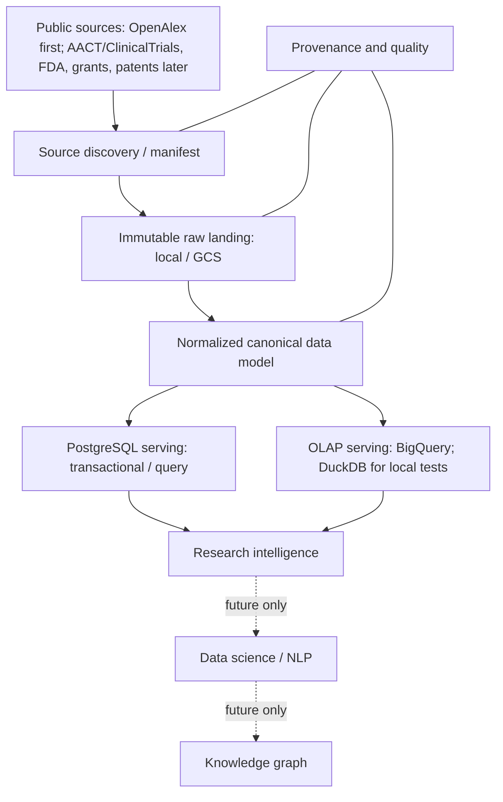

# Research Intelligence Data Platform

Local-first, cloud-ready foundation for public scholarly and research data.
Development uses **public OpenAlex or synthetic data only**, never Wiley enterprise
access or proprietary data.

## Phase 1 scope

This repository currently provides Python packaging, validated YAML configuration,
typed adapter contracts and fail-fast skeletons, structured JSON logging,
provenance metadata, a pure OpenAlex Works manifest parser and deterministic
size-bounded metadata sample selector, bounded anonymous OpenAlex snapshot manifest
discovery and file streaming, local PostgreSQL Compose tooling, offline tests, and
CI. The OpenAlex connector is the only implemented runtime network adapter; storage
and warehouse adapters remain fail-fast skeletons. Constructing an adapter or
loading configuration has no service side effects.

## Architecture



The diagram describes the **target**, not delivered pipelines. Do not assume
everything belongs in BigQuery. Query-pattern analysis must determine the
PostgreSQL/OLAP split: point lookups, relationship traversal, filtering, and
transactional requirements versus broad scans, aggregations, and analytical cost.
DuckDB provides a local analytical test engine, not a substitute for validating
PostgreSQL or BigQuery SQL dialects.

Canonical modeling will normalize entities (works, authors, institutions, etc.)
and relationships rather than create one giant flattened table. Raw landing must
preserve source bytes, use immutable keys, and support replay without overwrites.
Every future ingestion needs a run ID, source URI, timezone-aware retrieval time,
and SHA-256 checksum. Atomic create, checksum verification, and replay/conflict
semantics are defined by the ObjectStore contract but are not implemented yet.

### Interfaces

| Contract | Phase 1 boundary |
| --- | --- |
| `SourceConnector` | `discover()` returns manifest assets; `fetch()` returns a caller-owned stream |
| `OpenAlexAssetMetadata` | Validates one current-layout OpenAlex snapshot file description |
| `parse_openalex_works_manifest()` | Purely parses caller-provided current Works manifest content; no discovery or downloads |
| `select_openalex_works_sample()` | Selects bounded eligible metadata only; no object reads/writes or downloads |
| `OpenAlexConnector` | Anonymous manifest-only discovery plus size-limited streaming retrieval |
| `ObjectStore` | `put_if_absent()` requires provenance and never overwrites; `open()` is read-only |
| `Warehouse` | `query()` accepts bound parameters and returns a PyArrow table |

Skeletons: local/GCS object stores; PostgreSQL, BigQuery, and DuckDB warehouses.
Cloud SDKs and PostgreSQL drivers are deliberately deferred.
DuckDB is available as a development dependency for offline analytical tests.
Warehouse SQL and parameter conventions remain backend-specific; the interface
does not promise portable SQL. Writes/migrations need later explicit contracts.
The OpenAlex Works manifest parser, snapshot metadata model, identity and duplicate
rules, and bounded sample-selection contract are specified in
[the OpenAlex discovery and manifest contract](docs/architecture/openalex-manifest-contract.md).

The connector defaults to the current Works JSON Lines manifest at
`https://openalex.s3.amazonaws.com/data/jsonl/works/manifest.json`. Public OpenAlex
documentation describes the `openalex` S3 bucket and anonymous access (AWS CLI
examples use `--no-sign-request`); this adapter uses anonymous HTTPS only and never
uses AWS credential discovery. `jsonl` is gzip-compressed `.gz`; Parquet is
Snappy-compressed `.parquet`. Discovery reads a manifest capped at 1,000,000 bytes,
then applies the existing selector (default one file, 25,000,000 bytes). Fetching
streams from the fixed public bucket and independently enforces actual returned
bytes. The [architecture contract](docs/architecture/openalex-manifest-contract.md)
records the live connectivity observation and any environment limitation.

The network check is opt-in and reads only the bounded Works manifest:

```bash
python -m research_platform.sources.openalex.connectivity
```

It is not invoked by tests or `make test`.

## Local development

Requires Python 3.12+ and Make. Docker Compose is optional; tests do not need it.
Run these commands from the repository root:

```bash
python -m venv .venv
source .venv/bin/activate
make install
make test-unit
make test
make check
make build
```

`make check` compiles Python and checks installed dependency consistency; a
dedicated lint/type-check tool is not introduced in this initial foundation.
`make build` creates an ignored wheel under `dist/`. Direct dependencies are pinned
in `pyproject.toml`; this is not yet a fully locked transitive environment.

Load configuration explicitly; there is no implicit production selection:

```python
from research_platform.config import load_config
from research_platform.common.logging import configure_logging

config = load_config("config/local.yaml")
configure_logging(config.log_level)
```

YAML is safely parsed, `${VARIABLE}` references are resolved from the process
environment, and Pydantic rejects unknown fields and invalid backend selections.
Missing or empty references fail early. Environment substitutions happen **after**
YAML parsing, so values cannot introduce YAML structure. Relative data paths are
relative to the current working directory. Python does not automatically load
`.env`; logs must use safe event messages, never credentials or configuration dumps.

| File | Intent |
| --- | --- |
| `config/local.yaml` | Local landing, PostgreSQL serving selection, in-memory DuckDB |
| `config/gcp-sandbox.yaml` | GCS/BigQuery identifiers supplied via environment variables; no resources created |
| `config/dev.yaml`, `config/qa.yaml`, `config/prod.yaml` | Local-only placeholders, not deployment configurations |

The sandbox template requires `GOOGLE_CLOUD_PROJECT`, `GCS_BUCKET`, and
`BIGQUERY_DATASET`. Credentials are not YAML settings: future adapters will use
environment-provided credentials/ADC or workload identity. No cloud credentials
are needed for Phase 1 tests. Do not connect to any production environment.

### Optional local PostgreSQL

```bash
cp .env.example .env
# Edit .env and set a unique, local-only POSTGRES_PASSWORD.
make postgres-up
make postgres-down
```

Compose binds PostgreSQL only to `127.0.0.1` and requires a non-empty password.
It does not run migrations or ingest data. `postgres-down` preserves the local
database volume; explicitly remove volumes only when intentionally discarding data.
Set `POSTGRES_DSN` in the process environment when connection behavior is added;
never place a credential-bearing DSN in tracked YAML.

## Repository layout

```text
.github/                 Copilot engineering principles and test workflow
config/                  Local and future environment YAML templates
src/research_platform/
  common/                Structured logging
  config/                Configuration models and loader
  sources/openalex/      Public OpenAlex manifest parser and bounded connector
  ingestion/             Reserved: future orchestration
  storage/               Immutable ObjectStore contract; local/GCS skeletons
  warehouse/             Warehouse contract; PostgreSQL/BigQuery/DuckDB skeletons
  provenance/            Required ingestion metadata
  quality/               Reserved: future quality checks
  serving/               Reserved: future query services
sql/
  control/ raw/ canonical/ postgres/ olap/ quality/
dags/                    Reserved: Airflow later (no DAGs yet)
scripts/                 Reserved: operational tools
tests/
  unit/ integration/ fixtures/
data/
  manifests/ sample/ landing/  Ignored runtime data; no downloaded datasets
docs/
  architecture/ development/ data-model/ runbooks/
infrastructure/
  terraform/             Reserved: infrastructure later (no resources yet)
```

Empty directories are tracked with `.gitkeep`. Architecture and development
documentation live in this README for Phase 1. The `docs/` tree is reserved for
later Docusaurus/Mermaid publication; no Node application or docs deployment is
introduced yet.

## Tests and CI

`pytest` covers configuration/environment validation, adapter contracts, bounded
OpenAlex connector behavior with synthetic responses, provenance, JSON logging, and
an offline DuckDB/PyArrow interoperability smoke test. GitHub Actions runs install,
checks, tests, and wheel packaging on Python 3.12 with read-only repository
permissions. It needs no cloud secrets, database service, or public data downloads;
the opt-in connectivity check is not part of CI.

## Security and deferred work

- Never commit credentials, `.env`, service-account JSON, or large downloaded data.
  Credential files must live outside this repository, regardless of filename.
- Never hardcode cloud project IDs, use Wiley proprietary data, or provision
  costly cloud resources. Use only public OpenAlex or synthetic test fixtures.
- Airflow, Terraform resources, actual ingestion, canonical SQL migrations,
  deployed serving, and Docusaurus site setup are deferred.
- No LLM, ML, GenAI, NLP, or knowledge graph implementation is included.
- Future public sources include AACT/ClinicalTrials, FDA, grants, and patents.

The OpenAlex Works manifest parser and bounded selector remain offline boundaries.
The connector acquires only the selected-format Works manifest and provides
caller-owned bounded streams; it does not write raw data or connect to storage,
warehouses, or other runtime services.
