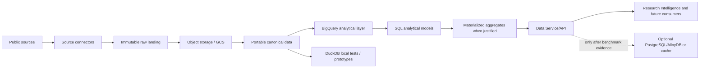

# GCP: BigQuery-first analytical architecture

BigQuery is the primary first analytical implementation on GCP. This direction
does not make GCP runtime adapters, cloud resources, or deployment part of the
current implementation. Configure environments explicitly, default to local
resources, and do not access production or create expensive cloud resources during
development.

## Target flow

## Design principles

- Keep immutable raw objects and provenance in object storage; use versioned
  paths, checksums, and explicit replay/conflict semantics. Do not overwrite raw
  source bytes.
- Keep canonical schemas portable and independent of BigQuery or PostgreSQL.
  Use Parquet where genuinely applicable and preserve normalized relationships.
- Use BigQuery for analytical workloads and high-volume relationships. Base
  partitioning, clustering, and query design on measured workloads; bound queries
  and consider data scanned and cost.
- Keep SQL dialects explicit. DuckDB supports local analytical testing but does
  not prove BigQuery dialect compatibility. Bind values instead of interpolating
  untrusted inputs.
- Expose domain capabilities through a storage-independent Data Service/API.
  Materialize repeated expensive outputs only when usage justifies their
  maintenance and cost.
- Assess PostgreSQL/AlloyDB only after benchmarking representative point lookups,
  expected concurrency, and freshness against BigQuery with API/cache. If needed,
  use it as a selective operational projection; do not copy every analytical
  relationship by default.
- Keep Spark/Dataproc and Iceberg/BigLake optional future choices. Revisit them
  only if measured volume, transformation complexity, ACID/time-travel needs,
  schema evolution, or multi-engine requirements warrant them.

GCS, BigQuery, PostgreSQL/AlloyDB, caches, Spark, Dataproc, and Iceberg/BigLake
runtime implementations are not included in this architecture documentation
change.
