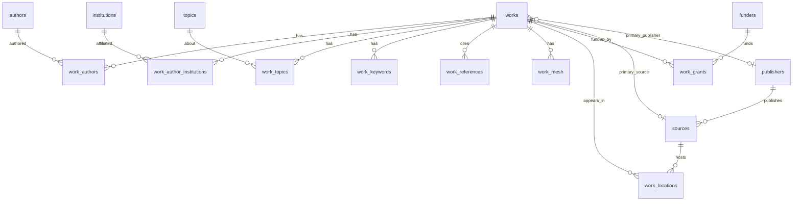

# OpenAlex canonical logical model (Step 11)

Step 11 defines a **normalized, portable** OpenAlex canonical model. It does not
implement ingestion, BigQuery physical design, PostgreSQL serving, or GCS.

Portable contracts live in `research_platform.canonical.openalex`:

| Module | Role |
| --- | --- |
| `identifiers.py` | Explicit ID normalization |
| `models.py` | Validated entity/relationship models |
| `schemas.py` | PyArrow interchange schemas (source of truth) |
| `mapping.py` | Source Work JSON → canonical bundle |
| `versioning.py` | Update precedence rules for later ingestion |
| `field_catalog.py` | SUPPORTED / DEFERRED / UNMAPPED / SOURCE-ONLY |

Optional local SQL review DDL: [`sql/canonical/001_openalex_canonical.sql`](../../sql/canonical/001_openalex_canonical.sql)
(**PostgreSQL 16+** only). It is not the future BigQuery model.

## Evidence basis

Mapping follows public OpenAlex Works API documentation and repository Step 08
notes. Real payload profiling is still pending public network access. Fields that
cannot be mapped confidently are catalogued rather than guessed.

## Identifier normalization

| Identifier | Canonical form | Also accepts |
| --- | --- | --- |
| OpenAlex entity | `W123`, `A123`, `I123`, `S123`, `P123`, `T123`, `F123` | `https://openalex.org/W123` |
| Keyword | `keywords/<slug>` | full OpenAlex keyword URL |
| DOI | lowercase bare DOI | `https://doi.org/...` |
| ORCID | `ACCT-000028` | ORCID URLs |
| ROR | bare ROR id | `https://ror.org/...` |
| ISSN / ISSN-L | `NNNN-NNNC` | spaced variants rejected |

Malformed **work** ids fail mapping. Malformed **referenced_works** entries become
`work_references` rows with `reference_status=MALFORMED` (not dropped silently).
Identifiers are never fabricated.

## Entity grains and keys

| Entity | PK | Notes |
| --- | --- | --- |
| `works` | `work_id` | Core bibliographic attributes + array presence flags + lineage |
| `authors` | `author_id` | |
| `institutions` | `institution_id` | |
| `sources` | `source_id` | ISSN-L; `host_publisher_id` when present |
| `publishers` | `publisher_id` | Separate from free-text host name |
| `topics` | `topic_id` | |
| `funders` | `funder_id` | |

## Relationship grains

| Relationship | Grain / uniqueness | Preserves |
| --- | --- | --- |
| `work_authors` | `(work_id, authorship_index)` | author order, corresponding flag, author id |
| `work_author_institutions` | `(work_id, authorship_index, institution_index)` | author↔institution association |
| `work_topics` | `(work_id, topic_id)` | optional score |
| `work_keywords` | `(work_id, keyword_id)` | optional score |
| `work_references` | unique `(work_id, referenced_work_id)` when id resolved | unresolved/malformed refs retained |
| `work_mesh` | `(work_id, descriptor_ui, qualifier_ui)` | qualifier may be empty |
| `work_locations` | `(work_id, location_index)` | optional `source_id`, primary flag |
| `work_grants` | `(work_id, funder_id, award_id)` | `award_id=""` when absent; no invented awards |

Authorship example:

```text
Work W1
  authorship_index=0 author A -> institutions I1, I2
  authorship_index=1 author B -> institution I3
```

Yields 2 `work_authors` rows and 3 `work_author_institutions` rows. It does **not**
emit a denormalized authors×institutions×topics product.

## Missing vs null vs empty

| Source observation | `*_presence` | Relationship rows |
| --- | --- | --- |
| key absent | `MISSING` | 0 |
| key: null | `NULL` | 0 |
| key: [] | `EMPTY` | 0 |
| key: […​] | `PRESENT` | one row per element (after dedupe) |

Empty arrays never become a single NULL relationship row.

## Version / deletion semantics

`CanonicalLineage` attaches `source_asset_id`, `source_checksum_sha256`,
`source_updated_date`, `run_id`, `processed_at`, `activity_state`, `deleted_at`.

`compare_work_versions(existing, incoming)`:

1. same checksum → `IDENTICAL`
2. compare `source_updated_date` → `NEWER` / `STALE`
3. equal dates, different checksum → `CONFLICT`
4. undated mismatch → `CONFLICT`

Deletion processing is Step 13; this step only models `ACTIVE` / `DELETED`.

## ER diagram



## Field support summary

See `FIELD_CATALOG` in code. Highlights:

- **SUPPORTED:** id, doi, title/display_name, dates, type, language, citation
  counts, open_access, authorships (+ institutions), topics, keywords, mesh,
  referenced_works, locations/primary_location, grants, created/updated dates
- **DEFERRED:** concepts, related_works, abstract_inverted_index, biblio,
  secondary ids (PMID/PMCID/MAG), APC, SDGs, best_oa_location
- **SOURCE_ONLY:** is_retracted, is_paratext, has_fulltext (not copied yet)

## Lineage integration with Step 10

Canonical rows carry the same asset checksum / run identity concepts as
`RecordProvenance` and immutable `IngestionProvenance`. Step 12 should:

1. land raw bytes + `IngestionProvenance`
2. map through `map_openalex_work`
3. persist control success via `ControlStore`
4. write `RecordProvenance` per canonical record id

## Out of scope

Ingestion (#20), deletion processor (#21), BigQuery runtime (#22), GCS (#9),
Airflow, AACT/other sources, ML/KG.
