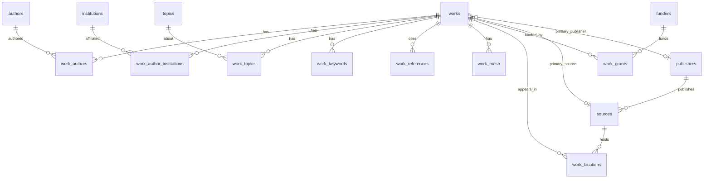

# OpenAlex canonical logical model (Step 11)

Step 11 defines a **normalized, portable** OpenAlex canonical model. It does not
implement ingestion, BigQuery physical design, PostgreSQL serving, or GCS.

Portable contracts live in `research_platform.canonical.openalex`:

| Module | Role |
| --- | --- |
| `identifiers.py` | Explicit ID normalization |
| `models.py` | Validated entity/relationship models |
| `schemas.py` | PyArrow interchange schemas (source of truth) |
| `mapping.py` | Source Work JSON → canonical bundle |
| `versioning.py` | Work update precedence for later ingestion |
| `reconciliation.py` | Shared-entity reconciliation across Works |
| `field_catalog.py` | SUPPORTED / DEFERRED / UNMAPPED / SOURCE-ONLY |

Optional local SQL review DDL: [`sql/canonical/001_openalex_canonical.sql`](../../sql/canonical/001_openalex_canonical.sql)
(**PostgreSQL 16+** only). It is not the future BigQuery model.

## Evidence basis

Mapping follows public OpenAlex Works API documentation and repository Step 08
notes. Real payload profiling is still pending public network access. Fields that
cannot be mapped confidently are catalogued rather than guessed.

## Identifier normalization

| Identifier | Canonical form | Also accepts |
| --- | --- | --- |
| OpenAlex entity | `W123`, `A123`, `I123`, `S123`, `P123`, `T123`, `F123` | `https://openalex.org/W123` |
| Keyword | `keywords/<slug>` | full OpenAlex keyword URL |
| DOI | lowercase bare DOI | `https://doi.org/...` |
| ORCID | `ACCT-000028` | ORCID URLs |
| ROR | bare ROR id | `https://ror.org/...` |
| ISSN / ISSN-L | `NNNN-NNNC` | spaced variants rejected |

Malformed **work** ids fail mapping. Malformed **referenced_works** entries become
`work_references` rows with `reference_status=MALFORMED` (not dropped silently).
Identifiers are never fabricated.

## Entity grains and keys

| Entity | PK | Notes |
| --- | --- | --- |
| `works` | `work_id` | Core bibliographic attributes + array presence flags + lineage |
| `authors` | `author_id` | Shared; see reconciliation |
| `institutions` | `institution_id` | Shared; see reconciliation |
| `sources` | `source_id` | ISSN-L; `host_publisher_id` when present |
| `publishers` | `publisher_id` | Separate from free-text host name |
| `topics` | `topic_id` | Shared; see reconciliation |
| `funders` | `funder_id` | Shared; see reconciliation |

## Relationship grains

Relationship identity uses **source-array ordinals** so nullable semantic fields
remain null. There is no hidden `None` ↔ `""` conversion for portable keys.

| Relationship | Grain / uniqueness | Preserves |
| --- | --- | --- |
| `work_authors` | `(work_id, authorship_index)` | author order, corresponding flag, author id |
| `work_author_institutions` | `(work_id, authorship_index, institution_index)` | author↔institution association |
| `work_topics` | `(work_id, topic_id)` | optional score; duplicate topic ids deduped |
| `work_keywords` | `(work_id, keyword_id)` | optional score; duplicate keyword ids deduped |
| `work_references` | `(work_id, reference_index)` | source position; `referenced_work_id` nullable |
| `work_mesh` | `(work_id, mesh_index)` | `qualifier_ui` nullable; no empty-string sentinel |
| `work_locations` | `(work_id, location_index)` | `location_origin`; optional `source_id` |
| `work_grants` | `(work_id, grant_index)` | `funder_id` / `award_id` nullable; source duplicates kept |

Authorship example:

```text
Work W1
  authorship_index=0 author A -> institutions I1, I2
  authorship_index=1 author B -> institution I3
```

Yields 2 `work_authors` rows and 3 `work_author_institutions` rows. It does **not**
emit a denormalized authors×institutions×topics product.

### WorkReference replay-safe grain

Every `referenced_works` array slot maps to one row keyed by
`(work_id, reference_index)`:

- duplicate resolved ids keep distinct indexes (source multiplicity preserved)
- `MALFORMED` and `MISSING` rows keep identity without fabricating OpenAlex ids
- `referenced_work_id` stays null when unresolved

### Null-preserving relationship keys

PyArrow is authoritative. Review DDL matches nullability:

- `WorkMesh.qualifier_ui` — nullable in model, Arrow, and PostgreSQL
- `WorkGrant.funder_id` / `award_id` — nullable in model, Arrow, and PostgreSQL

Primary keys use ordinals (`mesh_index`, `grant_index`, `reference_index`) so a
PostgreSQL PK never forces empty-string stand-ins for null semantics.

## Missing vs null vs empty

| Source observation | `*_presence` | Relationship rows |
| --- | --- | --- |
| key absent | `MISSING` | 0 |
| key: null | `NULL` | 0 |
| key: [] | `EMPTY` | 0 |
| key: […​] | `PRESENT` | one row per element (after documented dedupe) |

Empty arrays never become a single NULL relationship row.

### `locations_presence` vs `primary_location`

`locations_presence` describes **only** the source `locations` field:

| Source `locations` | `locations_presence` |
| --- | --- |
| missing | `MISSING` |
| null | `NULL` |
| [] | `EMPTY` |
| non-empty array | `PRESENT` |

`primary_location` must **not** rewrite `locations_presence`.

When `locations` is absent, null, or empty, and `primary_location` is an object,
the mapper may still emit one `WorkLocation` with
`location_origin=PRIMARY_LOCATION_FALLBACK` and `is_primary=true`. That fallback
is explicitly distinguished from rows observed in `locations`
(`location_origin=LOCATIONS_ARRAY`). Fallback never invents a presence of
`PRESENT` for a missing/null/empty `locations` array.

## Shared-entity reconciliation

Authors, institutions, sources, publishers, topics, and funders can appear in
multiple Works. `reconcile_shared_entity` / `merge_shared_entity` define
deterministic outcomes **separate from** Work version precedence
(`compare_work_versions`).

| Situation | Outcome |
| --- | --- |
| same id + identical payload fields | `IDENTICAL` |
| same id + complementary null/non-null, no non-null conflicts | `ENRICH` |
| same id + conflicting non-null values, incoming `source_updated_date` newer | `NEWER` |
| same id + conflicting non-null values, incoming older | `STALE` |
| same id + conflicting non-null values, equal/undated versions | `CONFLICT` |

Rules:

- Do not silently overwrite a richer entity with a poorer embedded summary.
- `ENRICH` merges by keeping non-null values from either side (`merge_shared_entity`).
- Conflicting non-null fields never merge; callers decide using `NEWER` /
  `STALE` / `CONFLICT`.
- Work checksum/date precedence remains in `versioning.py` and is not reused as
  a silent last-writer-wins rule for shared entities.

## Date normalization

`_parse_date` accepts **only** exact `YYYY-MM-DD` calendar-date strings (or a
Python `date`). It rejects:

- timestamps / `datetime` values
- truncated prefixes of longer strings
- trailing garbage after a date
- invalid calendar dates

OpenAlex Work `publication_date`, `created_date`, and `updated_date` are modeled
as calendar dates in this contract. No silent `text[:10]` truncation.

## Version / deletion semantics (Works)

`CanonicalLineage` attaches `source_asset_id`, `source_checksum_sha256`,
`source_updated_date`, `run_id`, `processed_at`, `activity_state`, `deleted_at`.

`compare_work_versions(existing, incoming)`:

1. same checksum → `IDENTICAL`
2. compare `source_updated_date` → `NEWER` / `STALE`
3. equal dates, different checksum → `CONFLICT`
4. undated mismatch → `CONFLICT`

Deletion processing is Step 13; this step only models `ACTIVE` / `DELETED`.

## ER diagram



## Field support summary

See `FIELD_CATALOG` in code. Highlights:

- **SUPPORTED:** id, doi, title/display_name, dates, type, language, citation
  counts, open_access, authorships (+ institutions), topics, keywords, mesh,
  referenced_works, locations/primary_location, grants, created/updated dates
- **DEFERRED:** concepts, related_works, abstract_inverted_index, biblio,
  secondary ids (PMID/PMCID/MAG), APC, SDGs, best_oa_location
- **SOURCE_ONLY:** is_retracted, is_paratext, has_fulltext (not copied yet)

## Lineage integration with Step 10

Canonical rows carry the same asset checksum / run identity concepts as
`RecordProvenance` and immutable `IngestionProvenance`. Step 12 local ingestion:

1. land raw bytes + `IngestionProvenance` (outside the DB transaction)
2. map through `map_openalex_work`
3. in one DB transaction: canonical upsert + `RecordProvenance` + source-file SUCCESS

Durable writes use `PostgresCanonicalStore` when selected; they do not go through
`Warehouse.query`. See [local Works ingestion](local-works-ingestion.md).

## Out of scope

Deletion processor (#21), BigQuery runtime (#22), GCS (#9), Airflow,
AACT/other sources, ML/KG. No BigQuery physical design in this step.
