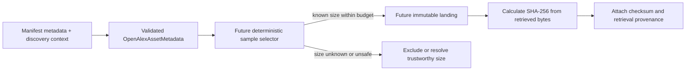

# OpenAlex discovery and manifest contract

This document defines an offline metadata boundary for one file in a current-layout
OpenAlex snapshot. It does not implement manifest parsing, discovery, sample
selection, network access, or landing. `OpenAlexConnector.discover()` and `fetch()`
remain fail-fast skeletons.

## Public format facts and contract assumptions

OpenAlex documents its current snapshot under `s3://openalex/data/`, with separate
`jsonl/` and `parquet/` prefixes. Its format documentation describes JSON Lines
files as gzip-compressed `.gz` files (one record per line), and Parquet files as
Snappy-compressed `.parquet` files (one record per row). It documents entity
directories, `updated_date=YYYY-MM-DD` partitions, and per-entity manifest fields
such as `date`, `format`, `entity`, `record_count`, `content_length`, and `files`
entries containing `url` and `meta.content_length` / `meta.record_count`.

Sources:

- [OpenAlex snapshot data format](https://github.com/ourresearch/docs/blob/main/download/snapshot-format.mdx)
- [OpenAlex: Download the snapshot](https://help.openalex.org/tutorials/download-the-snapshot/)

The typed model deliberately represents the manifest's declared `format`
(`jsonl` or `parquet`), not the compression codec. Thus, a gzip-compressed JSONL
object remains `jsonl`; it is never interpreted as Parquet. The model accepts only
the currently documented `s3://openalex/data/{jsonl|parquet}/...` namespace and
corresponding file suffixes. Pre-2026 legacy snapshot layouts are not part of this
contract. These validation choices are contract rules, not claims that a parser or
snapshot compatibility layer exists.

## Metadata boundary

`OpenAlexAssetMetadata` contains the resolved values for a file:

| Model value | Manifest/discovery source |
| --- | --- |
| `source` | Discovery context: fixed to `openalex`, not a per-file manifest value |
| `snapshot_date` | The manifest's `date`, carried from the manifest context to each file |
| `entity`, `content_format` | Manifest context (`entity` and declared `format`) |
| `file_uri` | Per-file manifest `url` |
| `byte_size`, `record_count` | Per-file `meta.content_length` and `meta.record_count` |
| `updated_date` | The file's `updated_date=...` URI partition, only when unambiguously supplied by a future discovery layer |

The combined manifest groups per-entity metadata, so a future discovery layer must
carry the applicable context into each asset. This contract does not load, parse,
or infer values from manifest JSON. Unknown optional values remain `None`, never
fabricated as zero.

## Validation, dates, and URIs

- `snapshot_date` is the manifest's calendar release date. `updated_date` is the
  source-record partition date; it is not the snapshot date or a retrieval time.
  Both accept calendar date values (including Python `date` objects) or canonical
  `YYYY-MM-DD` strings, without a time zone. Timestamps and numeric Unix timestamp
  values are rejected. Future `IngestionProvenance.retrieved_at` remains a
  separate, timezone-aware retrieval timestamp.
- Entity names are lowercase slugs. A file URI must use the `s3` scheme, the
  `openalex` bucket, and the matching
  `data/{content_format}/{entity}/...` namespace. Queries, fragments, whitespace,
  dot path segments, and mismatched suffixes are rejected. When `updated_date` is
  provided and the URI includes a partition date, they must agree.
- `byte_size` and `record_count` are non-negative integers or unknown (`None`).
  A future selector with a hard byte budget must not treat unknown size as zero or
  claim a metadata-only size bound. It must exclude that asset from the bounded
  selection or obtain trustworthy size information before admitting it. No
  metadata probe or download is implemented here.

## Identity and duplicates

`asset_id` is `oa-` plus the lowercase SHA-256 hex digest of the UTF-8 encoding of
the compact JSON array `[source, snapshot_date, entity, file_uri]`. It excludes
iteration position, run IDs, retrieval timestamps, byte size, record count, and
other observations. Reordering input fields or assets cannot change an identity;
the snapshot date is included so a new snapshot has a distinct identity.

`unique_assets()` collapses exact duplicate descriptions and returns assets sorted
by identity. If two descriptions have the same identity but differ in any metadata,
it raises `ValueError` rather than allowing iteration order to pick a winner.
`asset_id` identifies the source object; it is not a content checksum. The SHA-256
in future ingestion provenance must be calculated from the bytes actually
retrieved. Manifest metadata and byte-derived checksums are separate facts.

## Future flow

All arrows beyond metadata validation are future contracts, not delivered
workloads. The existing `SourceAsset(source, identifier, uri)` interface is
preserved: `to_source_asset()` adapts the validated metadata using the stable
`asset_id`. Connector discovery/fetch, storage, and warehouse operations continue
to raise `NotImplementedError`.

The fixture at `tests/fixtures/openalex_asset.json` is deliberately synthetic:
its dates, sizes, counts, and source paths are illustrative only and are not a
downloaded snapshot.
