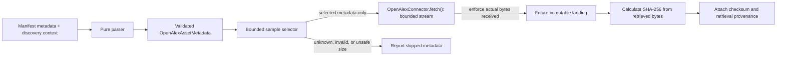

# OpenAlex discovery and manifest contract

This document defines the metadata boundary for files in a current-layout OpenAlex
snapshot, the pure parser for current Works per-entity manifests, and a deterministic
bounded development sample selector. `OpenAlexConnector` uses anonymous HTTPS for
manifest discovery and returns bounded caller-owned streams for selected objects.
It does not write raw data or perform ingestion.

## Public format facts and contract assumptions

OpenAlex documents its current snapshot under `s3://openalex/data/`, with separate
`jsonl/` and `parquet/` prefixes. Its format documentation describes JSON Lines
files as gzip-compressed `.gz` files (one record per line), and Parquet files as
Snappy-compressed `.parquet` files (one record per row). It documents entity
directories, `updated_date=YYYY-MM-DD` partitions, and per-entity manifest fields
such as `date`, `format`, `entity`, `record_count`, `content_length`, and `files`
entries containing `url` and `meta.content_length` / `meta.record_count`.

Sources:

- [OpenAlex snapshot data format](https://github.com/ourresearch/docs/blob/main/download/snapshot-format.mdx)
- [OpenAlex: Download the snapshot](https://help.openalex.org/tutorials/download-the-snapshot/)

The documented public bucket is `openalex`. The current JSON Lines Works manifest
endpoint is `https://openalex.s3.amazonaws.com/data/jsonl/works/manifest.json`;
the corresponding Parquet endpoint replaces `jsonl` with `parquet`. OpenAlex
documents anonymous public access (its CLI examples specify `--no-sign-request`).
The connector maps only canonical `s3://openalex/...` object URIs to HTTPS requests
for the fixed `openalex.s3.amazonaws.com` host. It sends no credentials, follows no
redirects, and does not invoke AWS credential discovery.

### Expected format versus live observation

The selected JSON Lines manifest is expected to declare `jsonl`; its payload files
are gzip-compressed `.gz` files. Selecting `parquet` instead reads that format's
separate Works manifest and expects Snappy-compressed `.parquet` files. These are
documented source-format expectations, not a claim about bytes observed by this
connector.

An explicit connectivity check was attempted on **2026-10-06 UTC** with
`python -m research_platform.sources.openalex.connectivity`. It failed with
`OpenAlex request failed` before an HTTP response was received. Consequently, this
environment did not verify anonymous access or observe a live manifest-declared
format; the actual format is **unobserved**. The documented expected format for the
default check remains `jsonl`. No credentials or alternate source were used.

The typed model deliberately represents the manifest's declared `format`
(`jsonl` or `parquet`), not the compression codec. Thus, a gzip-compressed JSONL
object remains `jsonl`; it is never interpreted as Parquet. The model accepts only
the currently documented `s3://openalex/data/{jsonl|parquet}/...` namespace and
corresponding file suffixes. Pre-2026 legacy snapshot layouts are not part of this
contract.

## Metadata boundary

`OpenAlexAssetMetadata` contains the resolved values for a file:

| Model value | Manifest/discovery source |
| --- | --- |
| `source` | Discovery context: fixed to `openalex`, not a per-file manifest value |
| `snapshot_date` | The per-entity manifest's `date`, or explicit caller context when omitted |
| `entity`, `content_format` | Per-entity manifest's `entity` and `format`, or explicit caller context when omitted |
| `file_uri` | Per-file manifest `url` |
| `byte_size`, `record_count` | Per-file `meta.content_length` and `meta.record_count` |
| `updated_date` | The file's single `updated_date=...` URI partition, when present |

The parser accepts one per-entity manifest only. Its `files` array and `url` values
are input data; the parser never treats a string as a path or fetches a URL. If the
manifest omits `date`, `entity`, or `format`, the corresponding explicit parser
argument may supply it. When both a manifest value and caller context are present,
they must agree. Context is validated even for an empty `files` array. Per-file
metadata and aggregate totals may be omitted; unknown per-file size/count values
remain `None`, never fabricated as zero. Unknown manifest, file, and `meta` fields
are rejected.

## Validation, dates, and URIs

- `snapshot_date` is the manifest's calendar release date. `updated_date` is the
  source-record partition date; it is not the snapshot date or a retrieval time.
  Both accept calendar date values (including Python `date` objects) or canonical
  `YYYY-MM-DD` strings, without a time zone. Timestamps and numeric Unix timestamp
  values are rejected. Future `IngestionProvenance.retrieved_at` remains a
  separate, timezone-aware retrieval timestamp.
- Entity names are lowercase slugs. A file URI must use the `s3` scheme, the
  `openalex` bucket, and the matching
  `data/{content_format}/{entity}/...` namespace. Queries, fragments, whitespace,
  dot path segments, and mismatched suffixes are rejected. When `updated_date` is
  provided and the URI includes a partition date, they must agree.
- `byte_size` and `record_count` are non-negative integers or unknown (`None`).
  The bounded selector never treats unknown size as zero; it excludes the asset
  rather than probing or downloading it to discover a size.

## Identity and duplicates

`asset_id` is `oa-` plus the lowercase SHA-256 hex digest of the UTF-8 encoding of
the compact JSON array `[source, snapshot_date, entity, file_uri]`. It excludes
iteration position, run IDs, retrieval timestamps, byte size, record count, and
other observations. Reordering input fields or assets cannot change an identity;
the snapshot date is included so a new snapshot has a distinct identity.

`unique_assets()` collapses exact duplicate descriptions and returns assets sorted
by identity. If two descriptions have the same identity but differ in any metadata,
it raises `ValueError` rather than allowing iteration order to pick a winner.
`asset_id` identifies the source object; it is not a content checksum. The SHA-256
in future ingestion provenance must be calculated from the bytes actually
retrieved. Manifest metadata and byte-derived checksums are separate facts. The
parser does not manufacture checksums, run IDs, retrieval times, or ingestion
provenance.

## Parser API and supported scope

`research_platform.sources.openalex.parse_openalex_works_manifest(content, *,
snapshot_date=None, entity=None, content_format=None)` returns a tuple of validated
`OpenAlexAssetMetadata` entries. `content` may be JSON text, UTF-8 JSON bytes, or an
already-decoded mapping. It cannot be a filesystem path or URL. The implementation
is pure with respect to external resources: it performs no I/O, network requests,
downloads, writes, discovery, or selection.

The supported format is the currently documented per-entity Works manifest for
either `jsonl`/gzip (`.gz`) or `parquet`/Snappy (`.parquet`), with top-level `date`,
`format`, `entity`, and `files`; optional totals are `record_count` and
`content_length`. Each file has `url` and optional `meta.content_length` and
`meta.record_count`. Counts and sizes must be non-negative integers (not booleans,
strings, or fractional values). Duplicate JSON object keys, unknown fields,
malformed structures, conflicting context, unsafe/inconsistent file URIs, and
unsupported entity/format values fail explicitly. Exact repeated assets collapse;
conflicting descriptions for one stable identity fail; results are sorted by
identity regardless of input entry order. Combined manifests, pre-2026 layouts,
other entities, downloads, and future source formats are deliberately excluded.

Example using caller-owned data:

```python
from research_platform.sources.openalex import parse_openalex_works_manifest

assets = parse_openalex_works_manifest(manifest_json)
```

`OpenAlexConnector.discover()` reads only the selected format's Works manifest,
caps the actual manifest bytes at 1,000,000, parses it with the shared parser, and
applies the shared bounded selector. It returns stable `SourceAsset` values for
selected files. Discovery never requests a data object.

Tests use small in-memory synthetic manifests only. No OpenAlex snapshot object
or manifest file is downloaded. The model fixture at
`tests/fixtures/openalex_asset.json` is also synthetic: dates, sizes, counts, and
source paths are illustrative.

## Bounded development sample

`select_openalex_works_sample()` accepts the parsed
`OpenAlexAssetMetadata` entries and a validated `SampleSelectionConfig`.
`PlatformConfig.sample_selection` exposes the same settings, defaulting to
`max_files=1` and `max_file_size_bytes=25_000_000` (decimal bytes). Both limits
must be positive strict integers; zero, negative values, booleans, strings, and
fractional values are rejected.

Before deduplication, the selector compares each same-identity description using
both field values and their types. Exact repeated descriptions collapse through
`unique_assets()`. Any conflicting description for an identity is consistently
rejected with `ValueError`, including a valid size of `1` paired with an invalid
boolean `True` or float `1.0`; input order cannot choose which metadata survives.
This duplicate conflict rule does not weaken the validated metadata model or
`unique_assets()` contract. A lone malformed size is reported as `INVALID_SIZE`
and cannot be selected.

The selector excludes non-Works entities, unsupported formats, requested
snapshot/update partition mismatches, unknown or invalid byte sizes, and files
larger than the configured size bound. If an asset fails multiple conditions,
the reported reason is the first matching condition in this precedence:
`WRONG_ENTITY`, `UNSUPPORTED_FORMAT`, `SNAPSHOT_MISMATCH`,
`UPDATED_DATE_MISMATCH`, `UNKNOWN_SIZE`, `INVALID_SIZE`, `OVERSIZED`.
`FILE_LIMIT_REACHED` is used only for otherwise eligible assets after ranking.
`eligible_count` is the number that pass these metadata checks before applying
the file-count limit. A report with no eligible or selected files is explicit:
it has `eligible_count=0`, an empty selection, and skip details for excluded
assets.

Eligible assets are ranked by ascending `byte_size`, then ascending
`updated_date`, then ascending `file_uri`. Because `updated_date` is optional,
assets without it sort before assets with a date when byte sizes tie. The first
`max_files` are selected; stable `asset_id` ascending breaks any remaining tie,
including equal size/date/URI entries from different snapshots. Skipped metadata
is sorted by stable `asset_id`; each entry has one safe reason code. The report
contains only asset metadata and configured bounds, not credentials or payload
data.

```python
from datetime import date

from research_platform.sources.openalex import (
    parse_openalex_works_manifest,
    select_openalex_works_sample,
)

assets = parse_openalex_works_manifest(manifest_json)
selection = select_openalex_works_sample(
    assets,
    config.sample_selection,
    snapshot_date=date(2025, 1, 15),
    updated_date=date(2025, 1, 14),
)
```

```text
Manifest
   -> Parser
   -> Bounded Sample Selector
   -> Selected metadata only
   -> OpenAlexConnector.fetch(): bounded stream
```

Selection reads or writes no objects. The connector downloads the manifest only;
`fetch()` streams a selected file with bounded reads and independently enforces
actual returned bytes up to the configured limit, even if `Content-Length` or
manifest metadata is missing or wrong. The default selector limits are
`max_files=1` and `max_file_size_bytes=25_000_000`; the connector's timeout defaults
to 10 seconds, with at most 3 attempts and exponential 0.1-second base backoff.
Configuration is hard-bounded to 30 seconds per request, 5 attempts, and 1 second
of base backoff. The explicit connectivity command uses one 5-second attempt.
401/403, unavailable endpoints, malformed manifests, timeouts, transport failures,
unexpected formats, truncation, and actual-byte overflow are explicit errors.
Retryable request errors are retried only before a response stream is returned;
payload streams are never restarted after delivery begins.

This connector does **not** write raw data, connect to GCP, PostgreSQL, or BigQuery,
or run Airflow. Its public connectivity check is an explicit, read-only request
limited to the 1,000,000-byte manifest boundary and is not part of default tests.

## Future flow



The manifest-to-parser, parser-to-metadata, and metadata-to-selector arrows are
metadata operations; connector discovery and retrieval implement the
`SourceConnector` boundary. The existing `SourceAsset(source, identifier, uri)`
interface is preserved: `to_source_asset()` adapts validated metadata using the
stable `asset_id`. Landing, storage, and warehouse operations remain future work.
