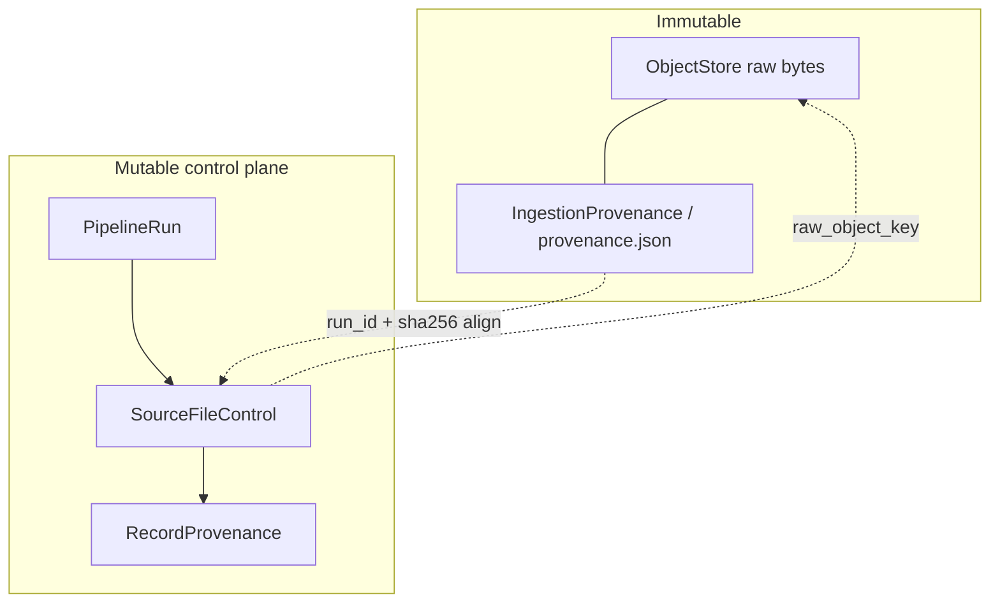
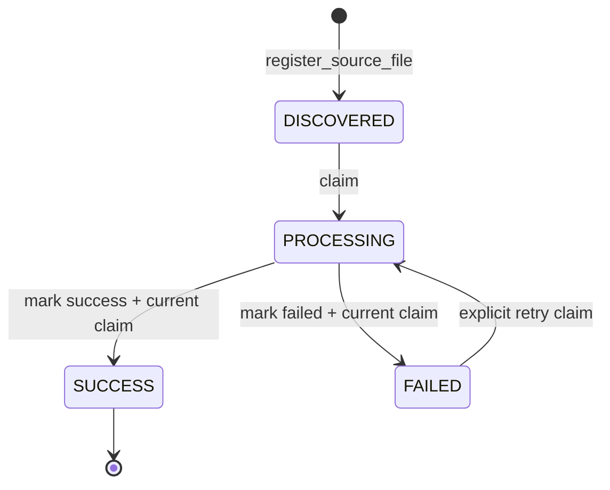
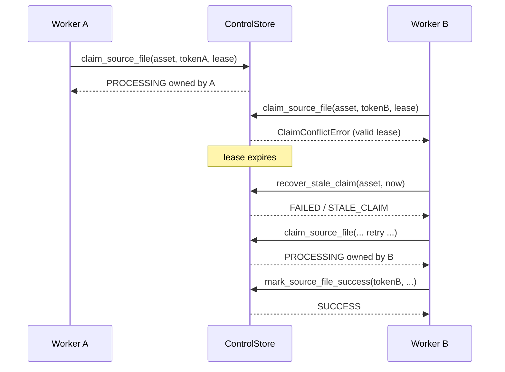

# Pipeline control and provenance contracts (Step 10)

Step 10 defines **modeling and write-boundary contracts** for later ingestion.
It does not open database connections, run migrations, claim work, or land data.

| Concern | Module / artifact |
| --- | --- |
| Mutable run + source-file control models | `research_platform.control.models` |
| Status transitions, claims, retries | `research_platform.control.lifecycle` |
| Registration idempotency / checksum conflicts | `research_platform.control.reconciliation` |
| Persistence protocol (unimplemented) | `research_platform.control.store.ControlStore` |
| Immutable retrieval provenance | existing `IngestionProvenance` |
| Record-level lineage model | `RecordProvenance` |
| Versioned DDL specification | [`sql/control/001_pipeline_control.sql`](../../sql/control/001_pipeline_control.sql) |

## Immutable retrieval provenance vs mutable control state



- **`IngestionProvenance`** is written with raw bytes and never overwritten. It
  records `run_id`, `source`, `source_uri`, `retrieved_at`, and content `sha256`.
- **`SourceFileControl`** is mutable workflow state: discovery, claim/lease,
  attempts, success/failure diagnostics, and the landed `raw_object_key`.
- **`RecordProvenance`** links a canonical record id to the source asset,
  checksum, run, and processing time. It does not store source payloads.

## Source-file lifecycle

States: `DISCOVERED`, `PROCESSING`, `SUCCESS`, `FAILED`.



| Transition | Event | Attempt counter |
| --- | --- | --- |
| DISCOVERED → PROCESSING | `claim` | set to `1` |
| PROCESSING → SUCCESS | `success` | unchanged |
| PROCESSING → FAILED | `fail` | unchanged |
| FAILED → PROCESSING | `retry` | `attempt_count + 1` |

Illegal examples (rejected by contract helpers):

- DISCOVERED → SUCCESS
- SUCCESS → PROCESSING / FAILED
- FAILED → PROCESSING without the explicit `retry` event

`SUCCESS` is terminal. Status field edits alone must never imply successful
canonical publication; `ControlStore.mark_source_file_success` requires the
current claim token and is intended to run inside the ingestion transaction
boundary after durable side effects.

## Claim / lease sequence



Rules:

- Only one worker owns an active `PROCESSING` claim.
- Acquisition must be atomic (conditional update / equivalent).
- `claim_token` + `claimed_by` identify ownership.
- Completion requires the current token and a non-expired lease.
- Stale leases are recovered explicitly to `FAILED` (`STALE_CLAIM`); another
  worker cannot silently steal a still-valid claim.
- Retries increment `attempt_count`.

## Registration idempotency

| Situation | Outcome |
| --- | --- |
| New asset | `CREATED` |
| Same identity + same/unknown checksum + DISCOVERED | `IDEMPOTENT_REPLAY` |
| Same identity + SUCCESS + same checksum | `ALREADY_SUCCESS` |
| Same identity + PROCESSING | `ALREADY_IN_PROGRESS` |
| Same identity + FAILED | `RETRYABLE_FAILURE` |
| Same identity + different known checksum | `CHECKSUM_CONFLICT` |

A changed checksum for the same immutable asset identity is a reconciliation
conflict, never a silent overwrite.

## Lineage

```text
OpenAlexAssetMetadata.asset_id
  -> SourceFileControl (mutable)
  -> ObjectStore key (immutable raw + IngestionProvenance)
  -> RecordProvenance (canonical record_id + asset_id + checksum + run_id)
```

## Write / transaction boundary

`Warehouse.query()` stays read-only. Control writes use `ControlStore`:

- `create_pipeline_run` / `finish_pipeline_run`
- `register_source_file`
- `claim_source_file`
- `mark_source_file_success` / `mark_source_file_failed`
- `recover_stale_claim`
- `record_provenance`

Intended later ingestion boundary for one asset:

```text
begin
  claim_source_file
  retrieve -> put_if_absent (ObjectStore) -> canonical publish
  record_provenance*
  mark_source_file_success | mark_source_file_failed
commit
```

`UnimplementedControlStore` is a fail-fast skeleton only.

## DDL / backend limitations

[`sql/control/001_pipeline_control.sql`](../../sql/control/001_pipeline_control.sql)
targets **PostgreSQL 16+**. It specifies primary keys, foreign keys, unique
indexes, status/claim/checksum checks, and useful indexes. Default tests only
assert the file’s contractual contents; they do **not** execute migrations.
DuckDB or mock checks do not prove PostgreSQL or BigQuery dialect compatibility.

## Out of scope for Step 10

Canonical OpenAlex modeling (#15), ingestion (#20), deletions (#21), GCS (#9),
warehouse adapters, Airflow, cloud resources, and credentials.
