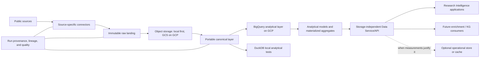

# Public Research Intelligence Data Platform

This repository is the beginning of a reusable platform for governed external
research data. OpenAlex is the first source. Each source has its own connector
and source-specific normalization into portable canonical schemas.

## Platform flow

The diagram describes the target architecture. The current foundation includes
configuration, contracts, bounded OpenAlex discovery/retrieval/profiling,
immutable **local** raw landing (`LocalObjectStore`), and tests. It does not
implement GCS landing, canonicalization, BigQuery runtime, a Data Service/API, or
downstream consumers. See [immutable local landing](immutable-local-landing.md).

## Layer responsibilities

- **Discovery and connectors:** discover source data and retrieve bounded source
  content. Connector and normalization logic are source-specific.
- **Immutable raw landing:** preserve original bytes and provenance for replay.
  Local landing streams source bytes, verifies SHA-256, and atomically publishes
  content with `IngestionProvenance`. Raw data and provenance are not overwritten;
  identical replay is a no-op and conflicts fail explicitly. GCS landing is later.
- **Canonical layer:** normalized, portable schemas independent of PostgreSQL or
  BigQuery. Use Parquet where applicable. Keep entities and relationships
  normalized rather than creating one giant flattened table.
- **Analytical layer:** BigQuery is the first GCP analytical implementation;
  DuckDB supports local analytical tests. Work-author, work-topic,
  work-institution, and work-citation/reference relationships primarily remain
  analytical rather than being copied wholesale to an operational database.
- **Models and aggregates:** publish analytical models and materialize repeated
  expensive queries when measured use warrants it. Avoid relationship fan-out.
- **Data Service/API:** expose supported domain capabilities, filters, freshness,
  latency expectations, pagination, limits, consistency, and sync/async behavior.
  Consumers should not depend on the underlying storage engine. Unrestricted raw
  SQL is not the application/product API.
- **Optional operational serving:** consider PostgreSQL/AlloyDB only after query
  patterns and benchmarks show BigQuery plus API/cache is insufficient.

## System boundary

This repository provides governed public/external research data that may later be
consumed by enrichment, knowledge graphs, Research Intelligence applications,
ARI, dashboards, APIs, or data science. Wiley's research-paper/content ingestion,
content registry, delivery, search/vectorization, enrichment, and knowledge-graph
systems remain separate and are not replaced or implemented here.

See [query routing](query-routing.md), [public data sources](public-data-sources.md),
[GCP / BigQuery-first guidance](gcp-bigquery-first.md), and the
[roadmap](roadmap.md).
