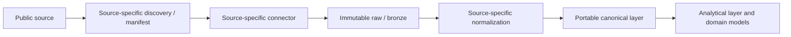
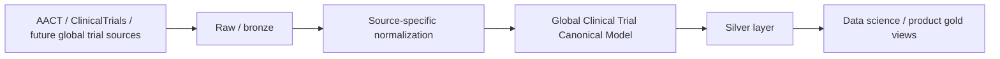

# Public data sources

The platform is designed for multiple public research data sources. Source
priority is:

1. OpenAlex
2. AACT / ClinicalTrials
3. OpenFDA and drug-related public data
4. Grants and funding data
5. Patents
6. News and releases
7. Other future public research datasets

OpenAlex is the only implemented source connector. Other sources below are
roadmap direction, not delivered integrations.

## Reusable source pattern

The pattern is reusable; source schemas and normalization rules are not assumed
to be interchangeable. Preserve source bytes and provenance so data can be
replayed, reprocessed, and reconciled independently of downstream serving systems.
Do not force the OpenAlex schema onto clinical-trial or other source data.

## AACT / ClinicalTrials

AACT is the planned next source and is documented in
[issue #2](https://github.com/agilandeenadhayalan41/research-intelligence-data-platform/issues/2).
This is a planning reference only; this repository does not implement AACT or
ClinicalTrials ingestion.

The likely logical pattern is:

AACT may already contain cleaned ClinicalTrials.gov data. Discover its actual
format, coverage, semantics, and normalization needs before designing the source
adapter or canonical model. Future source coverage may include the US, Europe,
China, WHO/global sources, and other regions; do not assume their models or
identifiers are equivalent.

## Public-data and scope boundaries

Use public data or synthetic fixtures only. Do not add proprietary Wiley content,
internal URLs, private project or dataset names, credentials, or enterprise-only
source requirements. FDA, grants, patents, news/releases, and other public
datasets remain future extensions until separately scoped.
