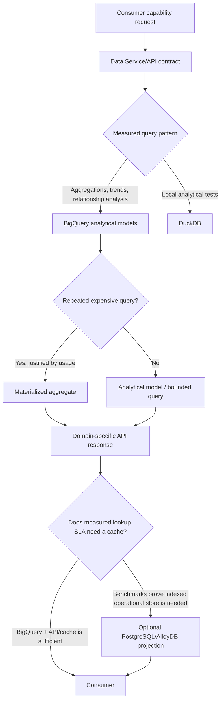

# Query patterns and routing

Choose serving paths from measured consumer requirements, not from a preferred
database. Query-pattern discovery and benchmarks precede any PostgreSQL/AlloyDB
decision. On GCP, BigQuery is the first analytical implementation; first test
whether BigQuery with an API and cache meets operational lookup requirements.

## Capability routing

The diagram is a decision model, not an implemented router. Consumers use stable
domain capabilities rather than learning whether results came from BigQuery,
PostgreSQL, Parquet, a cache, a knowledge graph, or a materialized aggregate.

## Representative workloads

Benchmark and record metadata and analytical workloads separately:

| Category | Representative workload |
| --- | --- |
| Metadata | DOI → work; OpenAlex ID → entity; eISSN/ISSN → source; publisher metadata |
| Analytics | Unique authors for a journal or publisher; publisher + topic article count |
| Analytics | Publisher + topic + license + year; institution/topic relationships |
| Analytics | Citation/reference relationships; publication and open-access trends |

For every workload, record latency, expected concurrency, data scanned, cost,
result size, freshness, frequency, and materialization suitability. Include
pagination, limits, consistency, and sync/async expectations in consumer
requirements. Bind SQL parameters; do not expose unrestricted raw SQL as the
primary application/product API.

Example domain capabilities include `GET /works/{doi}`,
`GET /sources/{eissn}`, `GET /publishers/{publisherId}`, and
`GET /journals/{journalId}/metrics`. These are consumer-contract examples, not
implemented endpoints.

## Operational-store gate

PostgreSQL/AlloyDB is optional, not a default destination for all canonical data.
Consider it only when measured requirements such as very low-latency DOI lookup,
high-frequency OpenAlex ID lookup, eISSN/ISSN metadata lookup, high-concurrency API
traffic, or repeated indexed point queries are not met by BigQuery plus API/cache.
Do not automatically copy high-volume work-author, work-topic,
work-institution, or citation/reference relationships into an operational store.

## Materialized aggregates

Materialize only after repeated expensive analytical usage is observed. Candidate
outputs include:

- `journal_stats`: journal ID, article count, unique author count, citation count,
  first publication year, and latest publication year.
- `publisher_topic_stats`: publisher ID, topic ID, license, publication year,
  article count, and unique author count.

Evaluate freshness, rebuild/reprocessing behavior, storage and query cost, and
relationship fan-out before publishing an aggregate.
